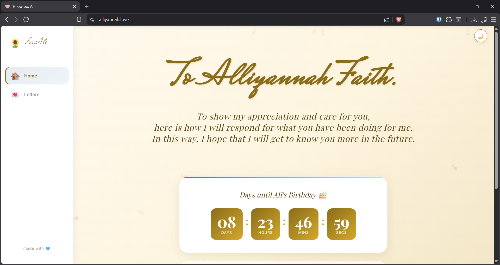
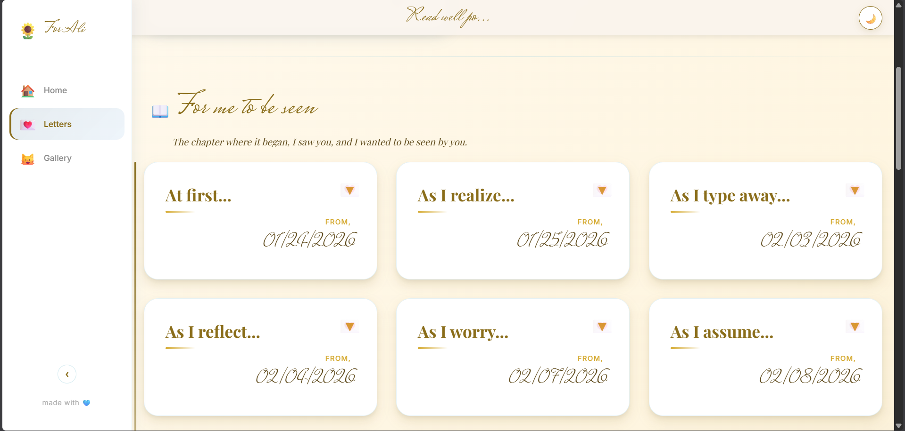
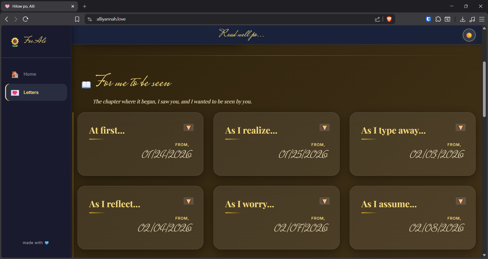

<div align="center">

# 🌻 Her Website

### *A quiet place for letters and memories.*

A personal website I built for someone special — handwritten letters, organized into chapters, with a real-time backend and a companion Android admin app.

**[🌐 Live site](https://alliyannah.love)** · **[📱 Companion app repo](https://github.com/mowtiie/Faithfully-App)**

</div>

---

## 💛 Why I built this

I started writing letters to someone I cared about. As they piled up, I wanted somewhere thoughtful to put them — not a Notes app, not a Google Doc. Something with intention. So I built her a website.

What began as a single static page turned into a full system: chapters of letters managed from an Android app I made, syncing in real time to a public site I can share. It's the kind of project that's been more fun to work on than anything I've shipped at school, because every detail mattered.

---

## ✨ Features

### Home page
- 🎂 Live countdown to her birthday (down to the second)
- 💛 Days-together counter that ticks up from the day we began
- 🌻 Floating sunflower background that drifts gently across the screen
- 🌙 Light and dark mode with a hand-tuned sunflower palette

### Letters page
- 📖 Chapters that organize letters into eras of our story
- 💌 Cards that expand on tap to reveal the full message
- 📌 A pinned card that always sits at the top, linking to the Android app I built for her
- 🩵 Subtle hand-lettered headings using *Mrs Saint Delafield* and *Playfair Display*

### Under the hood
- ⚡ Real-time updates via Firestore — chapters and letters appear instantly after I add them from the admin app
- 📱 Side drawer on desktop, bottom nav on mobile — same components, responsive layout
- ♿ Keyboard-friendly, screen-reader-friendly, and works without JavaScript for the basic content

---

## 📸 Screenshots

| Home | Letters | Dark mode |
|:---:|:---:|:---:|
|  |  |  |

---

## 🛠️ Tech stack

| Layer | What I used |
|---|---|
| **Frontend** | Vanilla HTML, CSS, JavaScript — no frameworks, no build step |
| **Backend** | [Firebase Firestore](https://firebase.google.com/docs/firestore) (real-time NoSQL) |
| **Hosting** | [GitHub Pages](https://pages.github.com/) with free HTTPS |
| **Fonts** | Google Fonts — *Playfair Display*, *Mrs Saint Delafield*, *Inter* |
| **Companion** | [Faithfully-App](https://github.com/mowtiie/Faithfully-App) — Android app in Java |

I intentionally avoided a framework. The whole site is a few hundred lines of plain JavaScript and CSS split into modular files, which keeps it fast, light, and easy to maintain.

---

## 📁 Project structure

```
.
├── index.html              # entry point
├── script.js               # all interactivity — section nav, countdowns, Firestore
├── css/
│   ├── base.css           # reset, variables, shared animations
│   ├── layout.css         # app shell, drawer, bottom nav, sticky header
│   ├── home.css           # header, countdowns, floating background
│   ├── letters.css        # cards, chapters, pinned card
│   └── theme.css          # dark mode overrides
├── icon.png
└── faithful.apk           # APK linked from the pinned card
```

---

## 🏗️ Architecture

```
   ┌──────────────────┐         ┌─────────────────┐
   │  Admin Android   │         │  Public Website │
   │       App        │         │  (GitHub Pages) │
   │   (Java + XML)   │         │  (HTML/CSS/JS)  │
   └────────┬─────────┘         └────────┬────────┘
            │ writes                     │ reads
            │                            │
            └───────────┬────────────────┘
                        ▼
              ┌──────────────────┐
              │  Firebase        │
              │  Firestore       │
              │                  │
              │  • chapters/     │
              │  • cards/        │
              └──────────────────┘
```

The Android app is the only thing that can write — security rules require authentication. The website reads freely. Both subscribe to real-time updates, so a change from the app appears on the site instantly without a page refresh.

---

## 🔧 Running it yourself

It's a static site, so:

```bash
git clone https://github.com/mowtiie/Faithfully-Web.git
cd Faithfully-Web
# Open index.html in any browser, or serve locally:
python3 -m http.server 8000
```

For Firestore data to load, you'd need to point `script.js` at your own Firebase project (the API key in this repo only allows reads on my specific data, restricted by HTTP referrer to my GitHub Pages domain).

---

## 🧠 What I learned

- How to design and ship a small full-stack system end to end
- Firestore security rules — the API key in client code is fine when paired with strong rules and HTTP referrer restrictions
- That splitting CSS into focused files at the right time is way better than a 1500-line `styles.css`
- How nice it feels to build something just for one person

---

## 👤 Made by

**Her Mowtiie.**

Made with 🌻 for someone who already knows it's hers.
