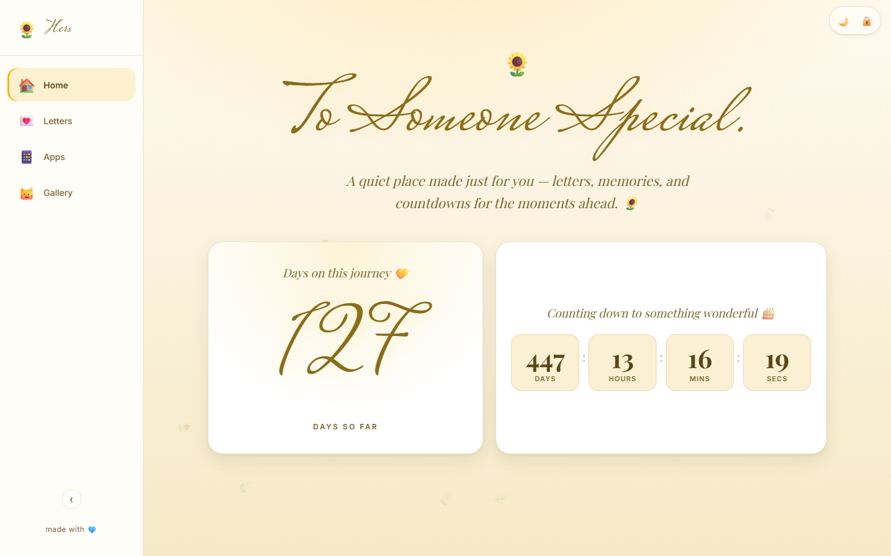
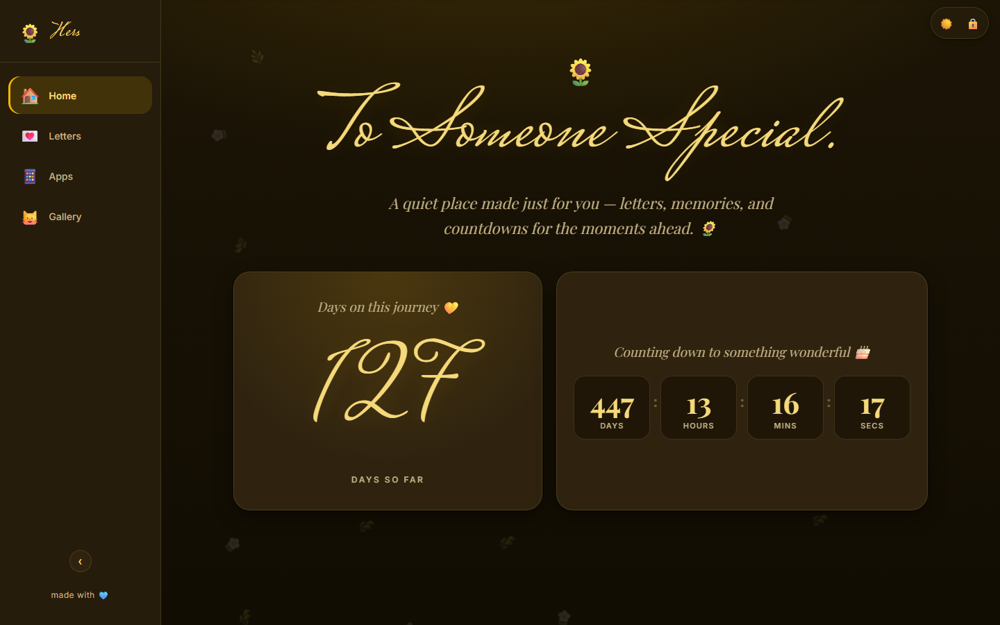
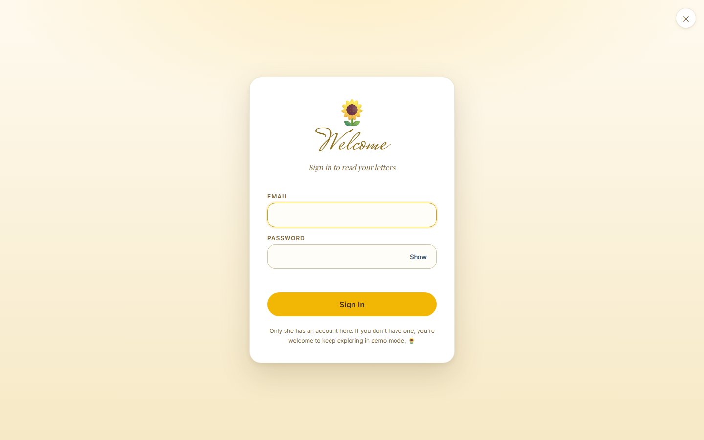
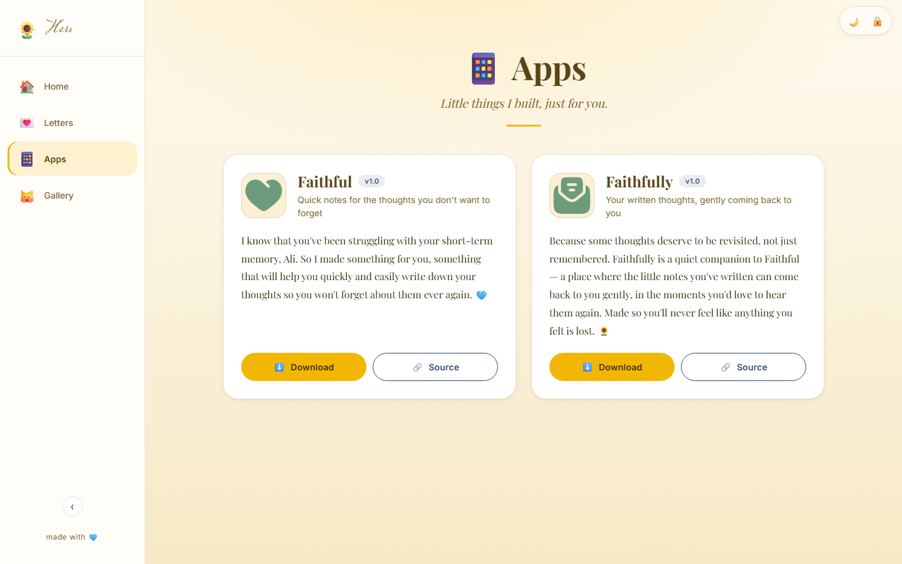

<div align="center">

# 🌻 Faithfully Web

### *A quiet place for letters, memories, and a countdown to her birthday.*

A personal website I built for someone special — handwritten letters organized into chapters, a real-time backend, a gallery of cat photos, an app showcase, and a companion Android admin app. Fully private for her, with a friendly demo mode for everyone else.

**[🌐 Live site](https://alliyannah.love)** · **[📱 Android companion app](https://github.com/mowtiie/Faithfully-App)**

</div>

---

## 💛 Why I built this

I started writing letters to someone I cared about. As they piled up, I wanted somewhere thoughtful to put them — not a Notes app, not a Google Doc. Something with intention. So I built her a website.

What began as a single static page turned into a full system: chapters of letters managed from an Android app I made, a gallery of cat photos, and real-time syncing to a public site I can share. It's the kind of project that's been more fun to work on than anything I've shipped at school, because every detail mattered.

---

## ✨ Features

### 🏠 Home
- 🎂 Live countdown to her birthday (down to the second)
- 💛 Days-together counter that ticks up from the day we began
- 🌻 Floating sunflower background that drifts gently across the screen
- 🌙 Light and dark mode with a hand-tuned sunflower palette that follows your system setting

### 💌 Letters
- 📖 Chapters that organize letters into eras of our story
- 💌 Letter cards that open into a full reading view, with previous/next navigation within the chapter
- 📚 Collapsible chapters with letter counts
- 🩵 Subtle hand-lettered headings using *Mrs Saint Delafield* and *Playfair Display*

### 📱 Apps
- 🌻 A showcase section for the small Android apps I built for her (Faithful, Faithfully)
- 📥 Each card has its own icon, tagline, version, download button, and source link
- ⚙️ Fully modular — new apps are just an entry in a config array

### 🐱 Gallery
- 🖼 Masonry grid of cat photos with shimmer loading skeletons
- 🔍 Lightbox viewer with prev/next navigation (click, swipe, or arrow keys), a photo counter, and neighbour preloading
- 📸 Optimized images — small thumbnails for the grid, full-res in the lightbox
- ↗️ Captions that fade in on hover, always visible on touch devices

### 🔐 Auth & Demo mode
- 🔑 Email/password sign-in for Ali; her account is the only one that unlocks the real content
- 👀 Demo mode for everyone else — the site auto-shows placeholder chapters, sample letters, and free stock cat photos so portfolio visitors can see the layout without seeing anything personal
- 🏷️ Every sample card and photo gets a subtle "SAMPLE" watermark
- 🌗 Session persists forever — Ali only signs in once per device

### 🧰 Under the hood
- ⚡ Real-time updates via Firestore — letters and photos appear instantly after the admin app adds them
- 📱 Collapsible side drawer on desktop, bottom nav on mobile — same components, fully responsive
- ☁️ Firebase Storage for photo hosting with public CDN delivery
- 🔒 Two-layer security — client-side auth UI + Firestore security rules that require an allow-listed UID

---

## 📸 Screenshots

| Home | Dark mode | Sign in | Apps |
|:---:|:---:|:---:|:---:|
|  |  |  |  |

---

## 🛠️ Tech stack

| Layer | What I used |
|---|---|
| **Frontend** | Vanilla HTML, CSS, JavaScript — no frameworks, no build step |
| **Database** | [Firebase Firestore](https://firebase.google.com/docs/firestore) (real-time NoSQL) |
| **File storage** | [Firebase Storage](https://firebase.google.com/docs/storage) (photo CDN) |
| **Auth** | [Firebase Auth](https://firebase.google.com/docs/auth) — email/password, UID-restricted reads AND writes |
| **Hosting** | [GitHub Pages](https://pages.github.com/) with free HTTPS |
| **Fonts** | Google Fonts — *Playfair Display*, *Mrs Saint Delafield*, *Inter* |
| **Companion** | [Faithfully App](https://github.com/mowtiie/Faithfully-App) — Android app in Java |

---

## 🏗️ Architecture

```
      ┌──────────────────┐         ┌─────────────────┐         ┌─────────────────┐
      │  Admin Android   │         │     User        │         │  Everyone else  │
      │       App        │         │  (signed in)    │         │  (demo mode)    │
      │  (Java + XML)    │         │                 │         │                 │
      └────────┬─────────┘         └────────┬────────┘         └────────┬────────┘
               │ writes                     │ reads                     │ reads
               │ (UID-restricted)           │ (UID-restricted)          │ mock data
               │                            │                           │ from js/data/mock.js
               └───────────┬────────────────┘                           │
                           ▼                                            ▼
             ┌────────────────────────────────┐             (no Firebase call)
             │  Firebase                       │
             │   • Firestore                  │
             │     - chapters/                │
             │     - cards/                   │
             │     - gallery/                 │
             │     - settings/                │
             │   • Storage                    │
             │     - gallery/*.jpg            │
             │   • Auth                       │
             │     - allow-listed UIDs only   │
             └────────────────────────────────┘
```

The Android app is the only thing that can *write*. Reads are restricted to approved UIDs by Firestore security rules; everyone else sees placeholder data from `js/data/mock.js` and never hits Firestore.

---

## 🔧 Running it yourself

It's a static site made of native ES modules, so it needs a local server (modules don't load from `file://`):

```bash
git clone https://github.com/mowtiie/Faithfully-Web.git
cd Faithfully-Web
python3 -m http.server 8000
```

For Firestore data and gallery photos to load, you'd need to point `js/firebase.js` at your own Firebase project, create your own admin and viewer accounts, put their UIDs in `ALLOWED_UIDS` in `js/firebase.js`, and write matching Firestore security rules.

Without configuring auth, you'll still see the site — just the demo mode with placeholder content.

---

## 👤 Made by

**Her Mowtiie.**

Made with 🌻 for someone who already knows it's hers.
